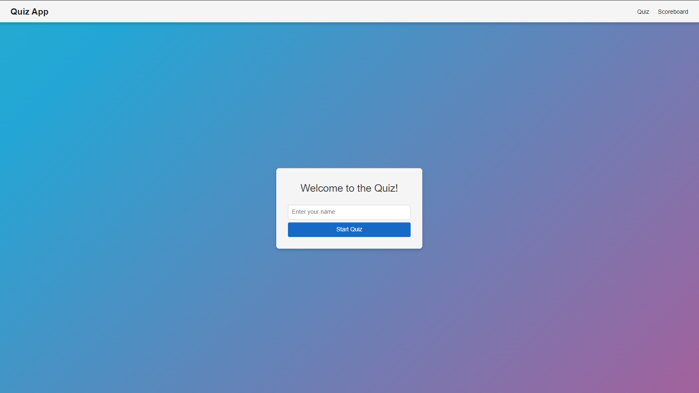
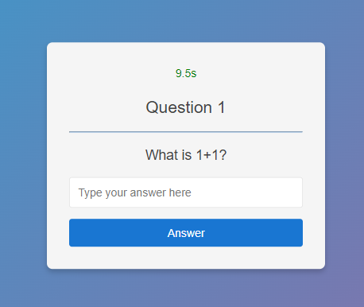
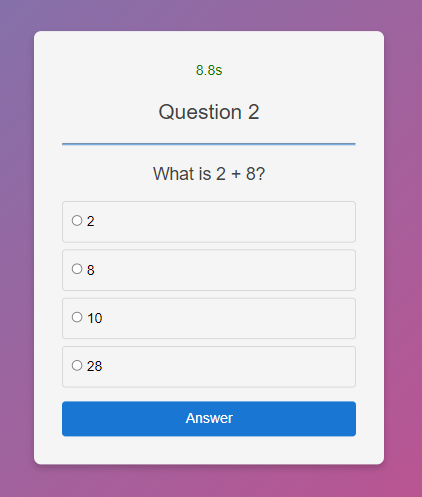

## 🖼️ Instructions

### 🏠 Home Page

When you open the quiz application, you'll see the main menu:

1. **Enter your username** – The input field will automatically focus as soon as you start typing.
2. **Start the quiz** – Press **Enter** after entering your username to begin the quiz.

## 🕹️ How to Play

Your goal is to answer all questions as quickly as possible. There are **two types of questions**:

1. **Open-ended Questions**
2. **Multiple Choice Questions**

**Got it right?** Great! You can go to the next question.

**Made a mistake?** Oops, that's the end of the quiz.

**Time's ticking!** You have just **10 seconds** to answer each question. If the clock runs out, the quiz is over.

### ✍️ Open-ended Questions

- Start typing your answer — the input field will automatically focus.
- Press **Enter** to submit.
  - **Correct Answer**: The field turns **green**.
  - **Incorrect Answer**: The field turns **red**, and the quiz ends.

Press **Enter** to proceed to the next question or result screen.

### 📋 Multiple Choice Questions

- Press a number between **1 and 4** to select your answer.
- Press **Enter** to submit.
  - **Correct Answer**: Your option turns **green**.
  - **Incorrect Answer**: Your option turns **red**, and the quiz ends.

## 🏆 Scoreboard

When you successfully complete the quiz, your completion time is recorded and added to the scoreboard for future reference.
